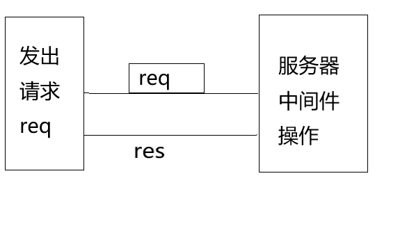

# Node的中间件
> 首先明确一个概念：Node没有中间件的概念，只是Node的Express框架有中间件的概念
所以中间件存在于 Express框架中，在框架中"中间件"的含义等于"插件(plugin)"用于扩展功能
的可拆装模块。

## 维基百科中解释
> Middleware is computer software that provides services to software applications beyond those available from the operating system. It can be described as "software glue". 中间件指的是这样一类计算机软件——它们的主要用途是为其他应用程序提供一些操作系统本身不提供的功能。可以视为一种“胶水软件”

所以了解中间件之前，首先你需要有Express框架的基础(在这里默认你已经有了Express框架的基础)

## 中间件
- 最简单的中间件的写法 ```function middlewar (req,res,next){next()}```
  执行next()方法 保证下一个中间件的执行
- Express框架中的写法 ```app.use([path] , function)```
  path 是可选参数，参数值是一个字符串，用于指定何种路径应用中间件
  function 是必须  参数值是一个函数    用于指定调用的中间件函数

**自定义的中间件函数**
```
// middleware.js
var setHeader = function(){
	return function (req,res,next){
		res.statusCode = 200;
		res.header = {'Content-Type':'text/html'};
		res.head = '<head><meta charset='utf-8'/></head>'
		next()
	}
}
// 自定义的中间件
```

**Express中调用自定义的中间件**
```
var express = require('express');
var app = express();
// 被创建的Express应用程序的对象
app.use('/demo',function(req,res,next){
	res.statusCode = 200;
	res.header = {'Content-Type':'text/html'};
	res.head = '<head><meta charset='utf-8'/></head>'
	next()
})
app.listen(8080,"127.0.0.1");
```

## 中间件的分类 
- Express内置中间件 ```express.static```
  express.static是Express目前唯一内置的中间件，用来处理静态数据的

- 自定义中间件

- 第三方中间件
  **body-parser**
	用于解析客户端请求的body内容
  **cookie-parser**
	解析浏览器发送的cookie
  **express-session**
	解析浏览器发送的session
  **querystring** ....等等
	解析请求路径中的参数

